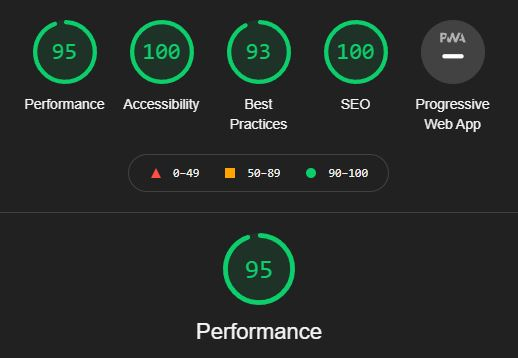

# **Jonnas Anti-Aging**
Jonnas Anti-Age website is targeted toward women 40+, who are worried about aging and getting wrinkles. The site helps them with some easy tips to delay wrinkles and gives them an irresistible offer - a free consultation. 

**Link to the website:** https://danjtl.github.io/jonnas-anti-age/

***

## **Features**
---

### **Navigation** 

Navigation menu is at the top and is easy to find and simple to use. When the user hovers over the links, it changes color to indicate it is clickable.  

### **Main Image And text Section**

The user can immediately see what the website is about. The site uses a big headline to capture the user interest and have an easy way to navigate further by clicking the "Anti-Aging Tips"-button.

### **Anti-Aging Tips Section**

The user receives three simple tips to prevent wrinkles as well as a recommendation to seek the help of a professional skin therapist. They see the offer of a free consultation in the third column and can easily navigate further by pressing the button.

### **Footer**

A simple design that provide clear links to all social media platforms. The links opens up in a new tab when clicked.

### **Contact Page**

The contact page show the user how to contact the company by phone, email and visiting address. 

### **Free Consultation Page**

This page offers the user a free consultation. They can easily fill in their first name, last name and email to take advantage of the irresistible offer. 

***

## **UX**
---

### **User Story**

A worrying aging women that is starting to get wrinkles, want some tips and advice to slow down the process so that she can feel more confident about herself.

### **Goals For Website Owners** 

The goal of the website is to capture leads. It provides the user with quick and easy content that explains the problem they are experiencing. The content leads them on to tips that ultimately encourage the user to seek the help of professionals if they are serious. And to make it totally risk-free for the users, the website offers them a free consultation. 

### **Wireframe** ###
Wireframe created in Balsamiq - design of the home page.

***

## **Testing And Validation**
---
- **Responsive design.** The website is tested with Chrome and Firefox developer tools on all standard screen sizes.

- **Different browsers work.** The website is tested in Chrome, Firefix, Edge and Safari

- **All links and buttons work.** Every link and button have been checked and works as planned. 

- **Form works.** The form works as planned and is submiting the information correct.

**HTML** - No errors were detected with official W3C validator.

Link: https://validator.w3.org/nu/?doc=https%3A%2F%2Fdanjtl.github.io%2Fjonnas-anti-age%2Findex.html

**CSS** - No errors were detected with official (Jigsaw) validator.

Link: https://jigsaw.w3.org/css-validator/validator?uri=https%3A%2F%2Fvalidator.w3.org%2Fnu%2F%3Fdoc%3Dhttps%253A%252F%252Fdanjtl.github.io%252Fjonnas-anti-age%252Findex.html&profile=css3svg&usermedium=all&warning=1&vextwarning=&lang=sv

**Accessibility report:**

***

## **Bugs** ##
---

No bugs were detected.

### **Unfixed bugs** ###

No unfixed bugs.
***

## **Technologies Used** ##
---

### **Languages** ##
- HTML
- CSS

### **Programs** ###
- Gitpod: Used for writing code.
- Git: Used for version-control.
- GitHub: Used for store data and hosting platform.
- Balsamiq: Used for wireframe.
***

## **Deployment** ##
---

The site was deployed with GitHub.
Steps to deployment:
- Navigate to Settings tab
- Select Pages from the side menu
- Under the source drop-down menu, select Main

Link to the website: https://danjtl.github.io/jonnas-anti-age/index.html
***

## **Credits** ##
---

### **Images** ###
Pictures is taken from https://www.canva.com/
### **Colors** ###
The color palette used is from https://mycolor.space/ca
### **Fonts** ###
Fonts is taken from https://fonts.google.com/
### **Icons** ###
Icons is taken from https://fontawesome.com/
### **Codes** ###
 
- CSS code - flex direction learned from https://developer.mozilla.org/en-US/docs/Web/CSS/flex-direction
- CSS code - justify-content learned from https://developer.mozilla.org/en-US/docs/Web/CSS/justify-content
- CSS code - box-shadow learned from https://www.w3schools.com/cssref/css3_pr_box-shadow.asp
- CSS code - transition learned from https://www.w3schools.com/css/css3_transitions.asp