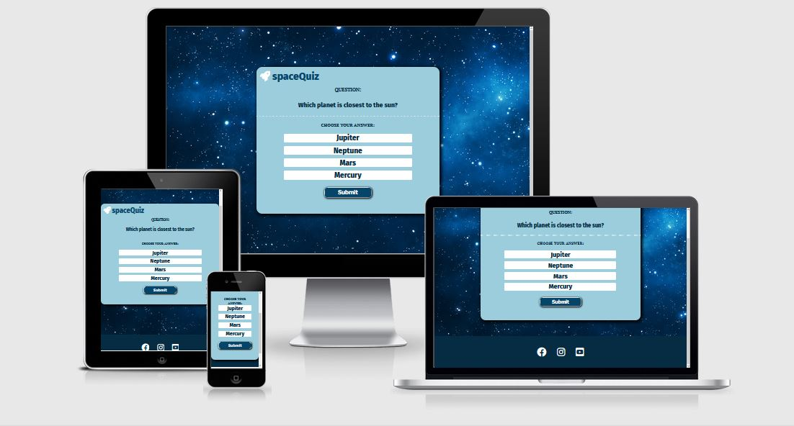
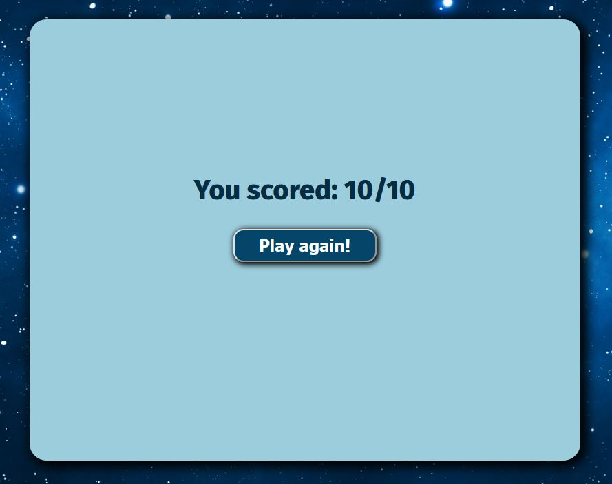

# **spaceQuiz**
spaceQuiz website is for people who are interested in space and want to test their knowledge of the subject. The site gives the user ten questions with four answer options each, and one of them is the correct answer. 

**Link to the website:** https://danjtl.github.io/spaceQuiz/

***

## **Features**
---

### **Question Area** 

In the upper part of the quiz, the question is clearly displayed in the middle to the user. In the top left the user see the website logo and name.  

### **Answer Area**

Underneath the question area the associated answer options will be shown for the user. The user can choose one of four answer options. 

### **Make a choice**

If the user has not selected an answer, the user can not proceed to the next question. An alert box will appear telling the user to make a selection. 

### **Made a choice**

When the user has made his choice, the answer option is selected and changes its color. This makes it easy for the user to both see and understand the choice the user has made. 

### **Submit Button**

When the user has made his choice, he clicks on the submit button and the next question is displayed with its answer options. 

***

### **New Question**

When the user sees the next question, his previous answer option has been deselected and the user can now select his new answer. 

***

### **Score Page**

Once the user has gone through all the questions, the user gets to see how many of the question was answered rigth. The user also has the opportunity to replay the quiz by clicking the "Play Again!" button. 

### **Footer**

A simple design that provide clear links to all social media platforms. The links opens up in a new tab when clicked.

## **UX**
---

### **User Story**
A person interested in space wants to test their knowledge of the subject by doing a fun quiz. Once the quiz is done, the user can redo the quiz to get a higher score or challenge family and friends to try to beat him. 

### **Goals For Website Owners** 
The goal of the website is to entertain the user with a quiz. It provides the user with spacerelated questions to give the user a challenge in their area of interest. The user will also leave the quiz with a new knowledge. 

### **Wireframe** ###
Was inspired by this design when I built spaceQuiz. 

***

## **Testing And Validation**
---
- **Responsive design.** The website is tested with Chrome and Firefox developer tools on all standard screen sizes.

- **Different browsers work.** The website is tested in Chrome, Firefix, Edge and Safari

- **All links and buttons work.** Every link and button have been checked and works as planned. 

**HTML** - No errors were detected with official W3C validator.

Link: https://validator.w3.org/nu/?doc=https%3A%2F%2Fdanjtl.github.io%2FspaceQuiz%2F

**CSS** - No errors were detected with official (Jigsaw) validator.

Link: https://jigsaw.w3.org/css-validator/validator?uri=https%3A%2F%2Fdanjtl.github.io%2FspaceQuiz%2F&profile=css3svg&usermedium=all&warning=1&vextwarning=&lang=sv

**JavaScript** - No warnings were detected when testing the code on JSHint website.

Link: https://jshint.com/

**Accessibility report:**

***

## **Bugs** ##
---

No bugs were detected.

### **Unfixed bugs** ###

No unfixed bugs.
***

## **Technologies Used** ##
---

### **Languages** ##
- HTML
- CSS
- JavaScript

### **Programs** ###
- Gitpod: Used for writing code.
- Git: Used for version-control.
- GitHub: Used for store data and hosting platform.
***

## **Deployment** ##
---

The site was deployed with GitHub.
Steps to deployment:
- Navigate to Settings tab
- Select Pages from the side menu
- Under the source drop-down menu, select Main

Link to the website: https://danjtl.github.io/spaceQuiz/
***

## **Credits** ##
---
Credit to my brother Jimmy Junttila to help me solve a few functions. 
I have taken inspiration from a YouTube channel called Florin Pop. Some code used in this video, was partially used for my own application. -  https://www.youtube.com/watch?v=dtKciwk_si4&t=3514s
### **Images** ###
Pictures is taken from https://www.canva.com/
### **Colors** ###
The color palette used is from https://paperheartdesign.com/blog/color-palette-awesome-space
### **Fonts** ###
Fonts is taken from https://fonts.google.com/
### **Icons** ###
Icons is taken from https://fontawesome.com/
### **Questions** ###
Questions is taken from:
- https://icebreakerideas.com/space-trivia/
- https://quizglobal.com/quizplay/quizplayqanda/Space%20Quiz%20Questions%20and%20Answers
### **Codes** ###
 
- JavaScript code - learned "checked radiobutton" code here: https://tinyurl.com/59ddenvd
- JavaScript code - learned play again button here: https://tinyurl.com/39e3f3pn
- JavaScript code - learned code here: https://tinyurl.com/yc5a78th
